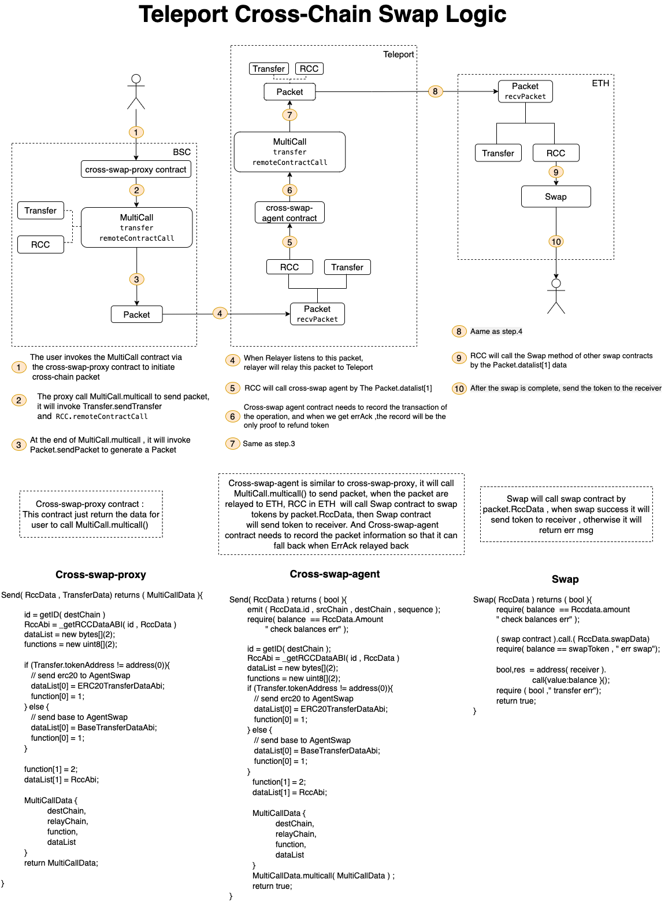

<!--
order：5
-->
# 2-Hop Agent example (A Cross-Chain Swap Dapp)

### This example is still under constructions

Below is an example of the logic behind a cross-chain swap dapp built upon the Teleport Network.

To notice, this dapp is integrated under the 2-Hop Agent Mode.

