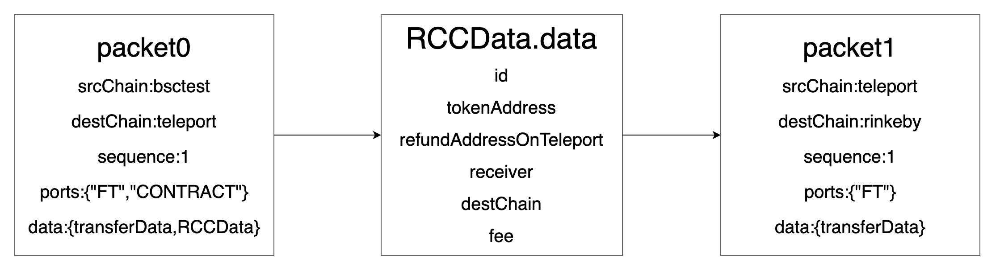

# How to bind the packet in 2-Hop Agent Mode


In the 2-Hop Agent flow like:

BSC -> Teleport -> rinkeby

The Agent performs two 1-Hop operations to achieve the purpose of 2-hop. 

Hop-1 BSC -> teleport generates Packet0 {bsctest, teleport, sequence0, data0}, 

Hop-2 teleport - > rinkeby generates Packet1 {teleport, rinkeby, sequence1, data1

We can see that during the procedure, there is no actual association between the two 1-hops except data. But we need both these two packets to be succeed to confirm our total-actions to be succeed. So we need to bind these two packets to a single 2-Hop action.

Therefore, we need to give the unique identifier associated with packet0 when the [Agent contract]() on teleport Chain receives packet0. 

Since the sequence of the corresponding packet transmission direction is unique, we can add a event in our [agent contract]():

```solidity
event SendEvent( 
    sha256( packet0.srcChain+packet0.destChain+packet0.sequence ),
    packet1.destChain,
    packet1.sequence )
```

The service applications can monitor for this event and using to packet0 info (srcChain,destChain,sequence) to get the connection between Packet 0 and Packet 1. If you don't know how to do this, please check the [last chapter](./ACK.md)

Then by checking the status of these two packet on destination chain, we can know the status of this 2-Hop Process.



## Examples in our official bridge implementation

Our Official bridge using the 2-Hop Agent mode, so you can take our official bridge code base as an example to learn.

Especially the [Proxy contract]() on evm chain and [Agent contract]() on teleport chain