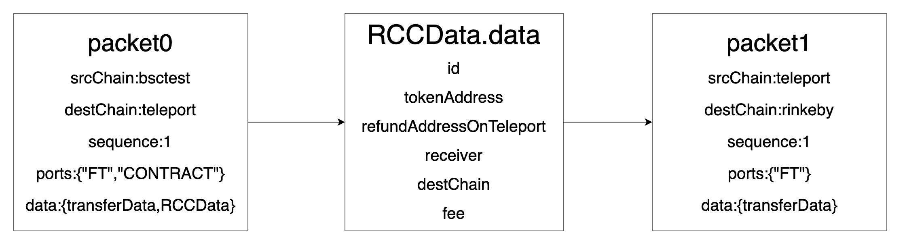

# How to bind the packet in 2-Hop Agent Mode


In the 2-Hop Agent Flow:

BSC -> Teleport -> Rinkeby

The Agent performs two 1-Hop operations to achieve the outcome of a 2-hop. 

Hop-1 BSC -> Teleport generates Packet0 {bsctest, teleport, sequence0, data0}, 

Hop-2 Teleport - > Rinkeby generates Packet1 {teleport, rinkeby, sequence1, data1

During the procedure, there is no actual association between the two 1-hop operations except for the data. However, both packets are required to succeed in order to confirm that the total-actions of the transfer succeed. Therefore, both packets need to be bound to a single 2-Hop action.

To accomplish this, a unique identifier that is associated with packet0 is created when the [Agent contract](https://github.com/teleport-network/xibc-contracts/blob/main/teleport/contracts/apps/agent/Agent.sol) on Teleport Chain receives packet0. 

SSince the sequence of the corresponding packet transmission direction is unique, we can add an event in our [Agent contract](https://github.com/teleport-network/xibc-contracts/blob/main/teleport/contracts/apps/agent/Agent.sol):

```solidity
event SendEvent( 
    sha256( packet0.srcChain+packet0.destChain+packet0.sequence ),
    packet1.destChain,
    packet1.sequence )
```

The service application can monitor for this event and using the packet0 info (srcChain,destChain,sequence), it can attain the connection between Packet 0 and Packet 1. For more information on how to do this, please check the [last chapter](./1Track.md)

Then by checking the status of these two packet on destination chain, we can know the status of this 2-Hop Process.



## Examples in our official bridge implementation

Our Official bridge using the 2-Hop Agent mode, so you can take our official bridge code base as an example to learn.

Especially the [Proxy contract](https://github.com/teleport-network/xibc-contracts/blob/main/evm/contracts/apps/agent/Proxy.sol) on evm chain and [Agent contract](https://github.com/teleport-network/xibc-contracts/blob/main/teleport/contracts/apps/agent/Agent.sol) on teleport chain