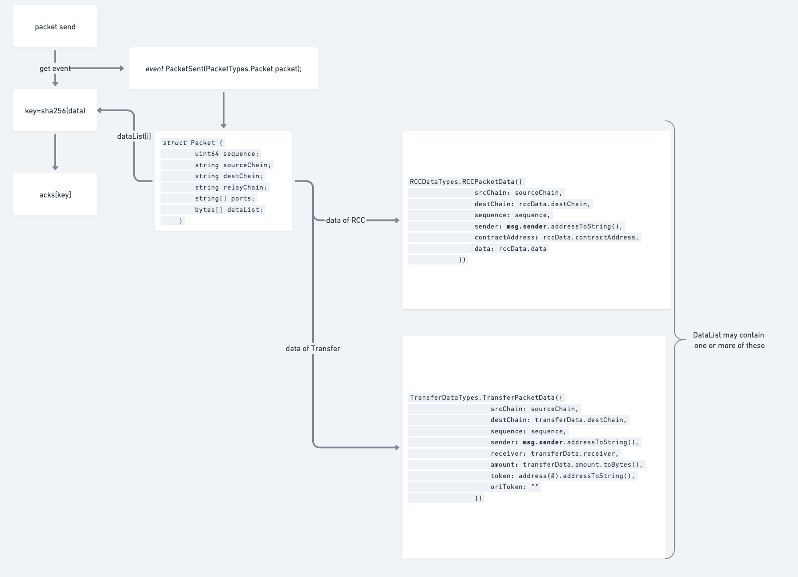

# Acknowledgement


## What is ack

In teleport, with each Packet sent, relay will provide an option to realy an ACK message to inform the contract or the developer the excution results of this Packet.

```solidity
struct Acknowledgement {
    bytes[] results; //tx results
    string message; //error messages destination tx generated
    string relayer; //for fees purpose
}
```

Under most situations, the ack will actively return to the source chain by the relayer.
But there are exceptions:

For Ethereum (and other high gas cost chain), users need to manually pay fees to let relayer give the ack back if needed, and the transfer Packet will not relay acks due to cost controll.

## Check ack status

You can check your acks status in Packet.sol contract bycalling the getAckStatus method in Packet.sol 

```solidity

function getAckStatus(
        string calldata sourceChain,
        string calldata destChain,
        uint64 sequence
    )
```

It will check the ackStatus mapping and return the following:

```solidity

mapping(bytes => uint8) public ackStatus; // 0 => not found , 1 => success , 2 => err

```
If you don't know how to the parameters, check the  section.


## How to get your acks

When the acks is realyed back to the soucechain, it will be stored in the source chain's RCC.sol contract.

```solidity

mapping(bytes32 => bytes) public override acks;

```

To get the acks, you need to  first. And construct the keys by encode your cross-chain data.





