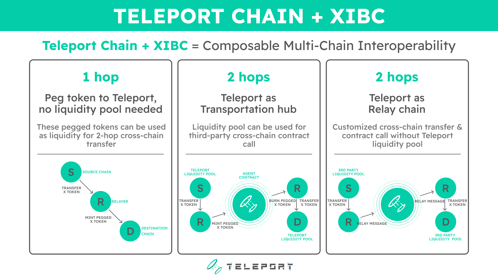

# Integration Guide (Currently on Testnet)

## Teleport supports different cross-chain approaches which include:

[1-Hop Chain A to Chain B](https://www.notion.so/1-Hop-Chain-A-to-Chain-B-d9acc846a8474dc4b5a10bec1afc0ad2)

[2-Hop Teleport as Relay Chain](https://www.notion.so/2-Hop-Teleport-as-Relay-Chain-06a14ab02d6a4037a898ee9c46fe4424)

[2-Hop Teleport Agent Pool](https://www.notion.so/2-Hop-Teleport-Agent-Pool-4a4b5ea94394474e93ac4d8bd31694c6)

Based on your application needs, you can select different approaches to develop and get the corresponding guide.

## The difference between them

### 1-Hop 

This is the way in which you transfer assets and/or messages directly from Chain A to Chain B. We currently support the connections from the following chains to the teleport Chain.

- BNB Chain
- Ethereum (Rinkeby)
- Arbitrum

examples:

A. ChainA to ChainB specific Assets bridge with own liquidity

B. Peg Blue-Chip Assets on Teleport Chain

C. Cross-chain contract call

### 2-Hop with teleport as Relay Chain

This design is mainly for the consideration of scalability. We use the Teleport chain as the relay chain in the architecture design, in this way, newly added blockchains won’t have to construct links with each existing chain, it only needs to connect to the relay chain (Teleport Chain). By integrating with this, you can build applications to send assets and/or messages from any chain to any chain we supported.

examples:

A. Universal assets bridge with third-party liquidity

B. cross-chain swap/lend/farm based on A

### 2-Hop as Transportation Hub

On the basis of the strong scalability, this approach enables user applications to handle additional logic on the Teleport chain as a relay chain and, more importantly, to take advantage of the massive liquidity provided by Teleport.

In this model, cross-chain messages are re-packet through the Teleport network (developers need to deploy contracts on the Teleport chain to handle the transmit logic).

examples:

A. Official Teleport Bridge：[https://bridge.testnet.teleport.network/](https://bridge.testnet.teleport.network/)

B. Possum: Cross-chain swap using teleport liquidity