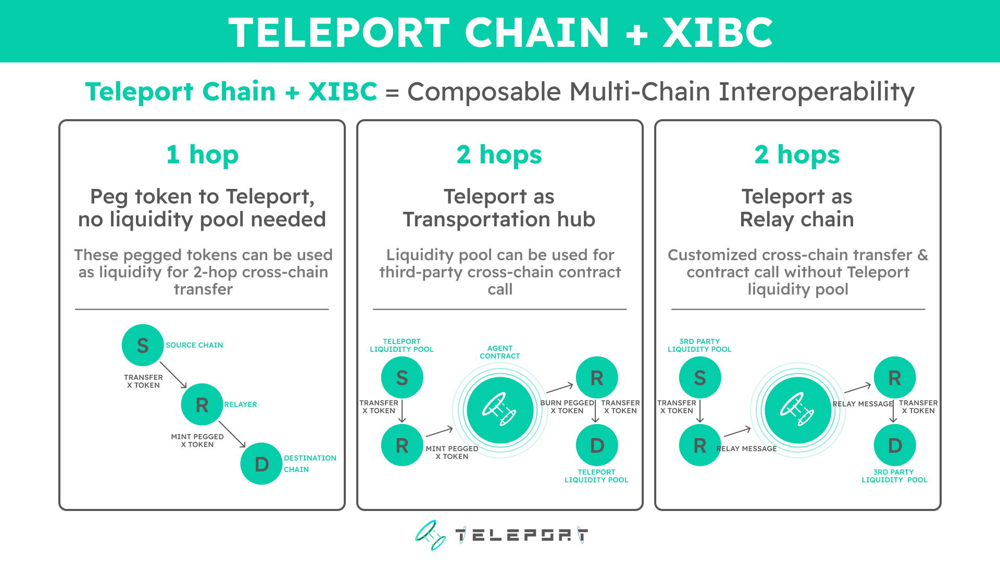

<!--
order：1
-->
# Getting Started

## Teleport supports different cross-chain approaches which include:

1-Hop: Chain A to Chain B

2-Hop: Teleport as Relay Chain

2-Hop: Teleport Agent Pool

Based on your application needs, you can pursue different development approaches with the corresponding guide.

## The difference between them 

### 1-Hop Chain A to Chain B

This method allows you to transfer assets and/or messages directly from Chain A to Chain B. We currently support the connections from the following chains to Teleport Chain.

- BNB Chain
- Ethereum (Rinkeby)
- Arbitrum

Examples:

A. ChainA to ChainB specific Assets bridge with own liquidity

B. Peg Blue-Chip Assets on Teleport Chain

C. [Cross-chain contract calls](./../Code-Examples/1.1-HopPingPong.md)

In practice, you can using this mode by simply specify the following 3 parameters:

SourceChain: Chain A

RelayChain:  ''     (Yes, this means without relay chain)

destChain: Chain B

### 2-Hop with Teleport as Relay Chain

This design is centered around the idea of scalability. Teleport Chain is used as the relay chain in the architecture of the design, this way, links between newly added blockchains and existing chains will not need to be developed.  All that is required is that the newly added chain connects to the relay chain (Teleport Chain). Via this design, applications can be built to send assets and/or messages between any of the chains supported by Teleport.

Examples:

A. Universal asset bridge with third-party liquidity

B. cross-chain swap/lend/yield based on the universal asset bridge outlined in 'A'

In practice, you can using this mode by simply specify the following 3 parameters:

SourceChain: Chain A

RelayChain: teleport

destChain: Chain B

### 2-Hop as a Transportation Hub

Scalability is also the center of this approach which enables applications to handle additional logic on the Teleport Chain as a relay chain and, more importantly, take advantage of the global liquidity provided by Teleport to execute transactions. 

In this model, cross-chain messages are re-packed through the Teleport network (developers need to deploy contracts on the Teleport chain to handle the transmit logic).

examples:

A. Official Teleport Bridge：[Code Example](../Code-Examples/4.2-HopAgent(Official-Bridge).md)

B. Cross-chain swap using teleport liquidity

In practice, you can think this mode as the combination of two 1-Hops, so 

First Hop:

SourceChain: Chain A

RelayChain: ''

destChain: teleport

Second Hop:

SourceChain: teleport

RealyChain: ''

destChain: Chain B