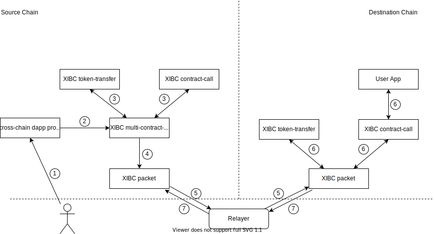

# Teleport Network

Teleport Network provides infrastructure and framework for cross-chain communication. It consists of a decentralized blockchain - Teleport Chain, a cross-chain protocol - XIBC, and developer SDKs for cross-chain dApps integration.

Some cross-chain application examples:

* **Cross-Chain DEX** user can swap tokens and provide liquidity on another chain by a single transaction.
* **Cross-Chain Lending Protocol** user can deposit tokens on one chain to borrow tokens on another chain.
* **Cross-Chain NFT Market** user can buy NFT on one chain from another chain.

### XIBC protocol

[XIBC protocol](../modules/XIBC/README.md) is a standard protocol based on [IBC](https://ibcprotocol.org/) for Teleport bridge implementation.

The protocol includes four modules, which are **client**, **packet**, **routing** and **basic applications**.

**Client** stores the trust root and verify packet(or acknowledge) commitment proof.
**Packet** is the entry point for sending and receiving packets, and stores the packet(and acknowledge).
**Routing** routes each sub-packet(or sub-acknowledges) to each basic applications to execute their own logic.
**Basic applications** are the cornerstone of application development on the XIBC protocol. They are token-transfer and remote-contract-call and multi-contract-call, you can directly use them for cross-chain transactions or develop your cross-chain dApps base on them.

#### XIBC client
There are currently two 
implementations to relay data: 

Light client

[TSS](https://github.com/teleport-network/documents/blob/main/modules/XIBC/tss.md)

The light client is the default implementation of XIBC relayer, which is trustless and permissionless. On the other hand, the TSS client is used where the light client is not feasible, for chains like Bitcoin which is not programmable, for layer2 like Arbitrum which doesn't have block to provide trust root, and for the dest chain Ethereum which is too expensive to verify trust root and state proof.

## Architecture

### End-to-End Flow

#### Cross-chain interoperability between two chains

1. User sends a cross-chain transaction from source chain via XIBC application contracts.
2. Source chain XIBC contracts generate cross-chain packet.
3. Relayer syncs the trust root, cross-chain packet and commitment proof from the source chain to destination chain. In most scenarios, the trust root is the merkle root of state tree, and the proof of commitment is the merkle proof of the commitment in state tree.
4. Destination chain XIBC contracts receive the cross-chain packet and verify the proof, and then execute the cross-chain package and generate acknowledge.
5. Relayer syncs the trust root, acknowledge and acknowledge commitment proof from the destination chain to source chain.
6. Source chain XIBC contracts receives the ack and verify the proof, and then execute the ack. for instance, refund user funds if the cross-chain transfer fails.

#### Cross-chain interoperability between two chains via relay-chain

The Teleport Chain just as a relay chain without any packet processing logic.

1. User sends the cross-chain transaction with the specified relay chain from the source chain via the XIBC application contracts.
2. Source chain XIBC contracts generate cross-chain packet.
3. Relayer syncs the trust root, cross-chain packet and commitment proof from the source chain to relay chain.
4. Relay chain XIBC contracts receive the cross-chain data packet and verifies the proof, and then stores the data packet without any processing.
5. Relayer syncs the trust root, cross-chain packet and commitment proof from the relay chain to destination chain.
6. Destination chain XIBC packet contracts receive the cross-chain packet and verify the proof, and then execute the cross-chain package and generate acknowledge.
7. Relayer syncs the trust root, acknowledge, acknowledge commitment proof from the destination chain to relay chain.
8. Relay chain XIBC contracts receive the cross-chain acknowledge packet and verifies the proof, and then stores the acknowledge without any processing.
9. Relayer syncs the trust root, acknowledge and acknowledge commitment proof from the relay chain to source chain.
10. Source chain XIBC contracts receives the ack and verify the proof, and then execute the ack. for instance, refund user funds if the cross-chain transfer fails.

### Develop your cross-chain dApps

XIBC protocol can be integrated with existing dApps seamlessly to empower them cross-chain interoperability. For example, add cross-chain swap function to Uniswap, or add cross-chain bidding function to OpenSea.

XIBC protocol contains three basic application contracts: token-transfer, remote-contract-call and multi-contract-call.

Token-transfer contract allows users or other contracts to invoke and initiate a cross-chain token-transfer packet. It also provides a shared cross-chain funding pool for all applications between the two chains.

Remote-contract-call contract allows users or other contracts to invoke and initiate a cross-chain contract-call packet.

Multi-call contract allows users or other contracts to call and initiate cross-chain packet, which contain multiple cross-chain token transfers and cross-chain contract-call sub-packets.

Developers can use the combination of the above three basic contracts to develop any cross-chain interoperability contracts.

Let us explain step by step the IBC protocol application design pattern of XIBC and how to develop an application through two examples

#### Remote contract call with token transfer

Step 1: User invokes the cross-chain method of dApp proxy

The cross-chain dApp proxy is deployed on source chain by the developers for their dApp on destination chain. The user now interacts with the proxy to initiate the cross-chain transaction. 

Step 2: dApp proxy invokes XIBC multi-call contract

Step 3: XIBC multi-call contract invoke XIBC token-transfer contract and XIBC remote-contract-call contract to generate sub-packets

Step 4: XIBC packet initiates cross-chain packet

XIBC multi-call contract assembles all sub-packets into the cross-chain packet data and invokes the packet contract `[sendMultiPacket](https://github.com/teleport-network/xibc-contracts/blob/main/evm/contracts/core/packet/Packet.sol#L152)` function. Packet contract will verify the validity of the packet and store it.

Step 5: Relayers packet to destination chain

Relayers packet relay trust root, packet and packet proof to destination chain.

Step 6: Excute packet on destination chain

Destination chain XIBC packet contract receives the cross-chain packet and verify the proof, and then route sub-packets to XIBC token-transfer contract and remote-contract-call contract. Basic application contracts execute their own logic and return to packet contract sub-acknowledges, packet contract aggregate all sub-acknowledges and store an acknowledge corresponding to the packet.

Step 7: Relayers relay acknowledge back to source chain

Step 8: Execute acknowledge on source chain

Source chain XIBC packet contract receives the ack and verify the proof, and then route each sub-acknowledge to XIBC application contracts. 
XIBC token-transfer contract will [refund user funds if get an error acknowledge](https://github.com/teleport-network/xibc-contracts/blob/main/evm/contracts/apps/transfer/Transfer.sol#L434), RCC will store the [ack](https://github.com/teleport-network/xibc-contracts/blob/main/evm/contracts/apps/rcc/RCC.sol#L156) and Users can execute their own exception handling logic through this data.

#### Cross-chain transfer via Teleport using Teleport funding pool

In the above example, token-transfer contract not only generates the cross-chain token transfer sub-packet, but also provides a cross-chain funding pool for cross-chain liquidity.

The teleport funding pool can be harnessed via a "two hops" transaction.

Step 1: User initiates a transaction to dApp

User initiates a transaction to the cross-chain transfer via Teleport basic application contract, 
which contains token-transfer and remote-contract-call sub-operations on Teleport Chain.

Step 2: dApp proxy invokes XIBC multi-call contract

Step 3: XIBC multi-call contract invoke XIBC token-transfer contract and XIBC remote-contract-call contract to generate sub-packets

The token-transfer receiver address on Teleport chain is remote-contract-call contract, so the remote-contract-call contract can use the funds to invoke cross-chain-transfer-via teleport contract on Teleport chain.

